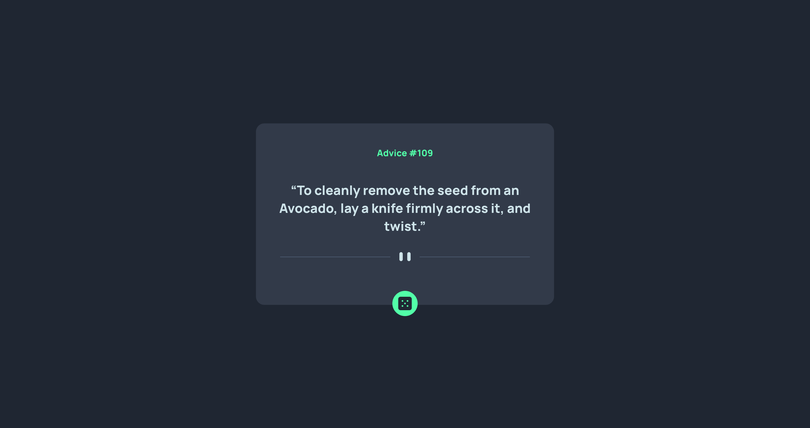

# Frontend Mentor - Advice generator app solution

This is a solution to the [Advice generator app challenge on Frontend Mentor](https://www.frontendmentor.io/challenges/advice-generator-app-QdUG-13db). Frontend Mentor challenges help you improve your coding skills by building realistic projects.

## Table of contents

- [Overview](#overview)
  - [The challenge](#the-challenge)
  - [Screenshot](#screenshot)
  - [Links](#links)
- [My process](#my-process)
  - [Built with](#built-with)
  - [What I learned](#what-i-learned)
  - [Continued development](#continued-development)
  - [Useful resources](#useful-resources)


## Overview

### The challenge

Users should be able to:

    View the optimal layout for the app depending on their device's screen size
    See hover states for all interactive elements on the page
    Generate a new piece of advice by clicking the dice icon

 

### Screenshot




### Links

- Solution URL: [Add solution URL here](https://github.com/ieUlysses/adviceGenerator/edit/main/README.md)
- Live Site URL: [Add live site URL here](https://advice-generator-pix6kc51z-ieulysses.vercel.app/)

## My process

### Built with

- Semantic HTML5 markup
- CSS custom properties
- Flexbox
- React
- Context APi
- Axios
- Sass
- Mobile-first workflow
- [React](https://reactjs.org/) - JS library


### What I learned
This project was my first where I went all in with Sass. I tend to gravitate to MUI or Borrtstrap but I enjoyed the challenge of this app. 

I decided to add the following clause to avoid a previous error I had that was caused by the site rendering beofre the pull request could be processed ie{slip.id would be undefined when it is being called} . By supplying starter values I can prevent this. 

```
const [id, setId] = useState(1)
    
    const [slip, setSlip] = useState({ slip: { id: 404, advice: "This is a shade embarassing" } })
    const baseURL = `https://api.adviceslip.com/advice/${id}`;
```

If you want more help with writing markdown, we'd recommend checking out [The Markdown Guide](https://www.markdownguide.org/) to learn more.


### Continued development

In the future I might have to look into simplyfying my solutions. I do not think tht using contextAPI was necessary but i aproaached the task with a mindset that I may want to expand it. having context set up from the start makes this easier (for me aatleast)


### Useful resources

- [Resource 1](https://www.youtube.com/watch?v=kpcjSaRngg8&t=1085s) - I would not have been able to complete this project without this guy. as a Sass beginner i was able to pick up enough basics and not get overwhelmed. To anyone looking to get a better understanding of Sass this is a great start

- [Example 2](https://html-css-js.com/css/generator/box-shadow/) - This has been a go to of ine for a long time. fast and easy box shadow generatoe. I love the preview, saves time when configuring.


Coded with <3 in Berlin by James Conway. 
James.conway@gmx.de

